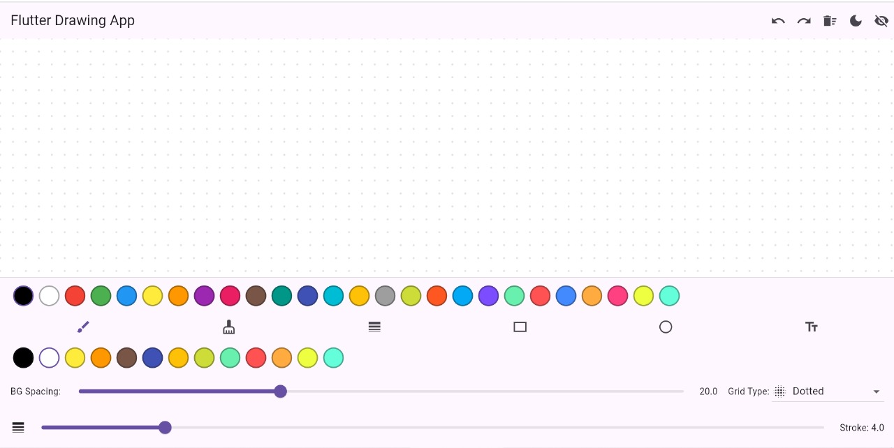
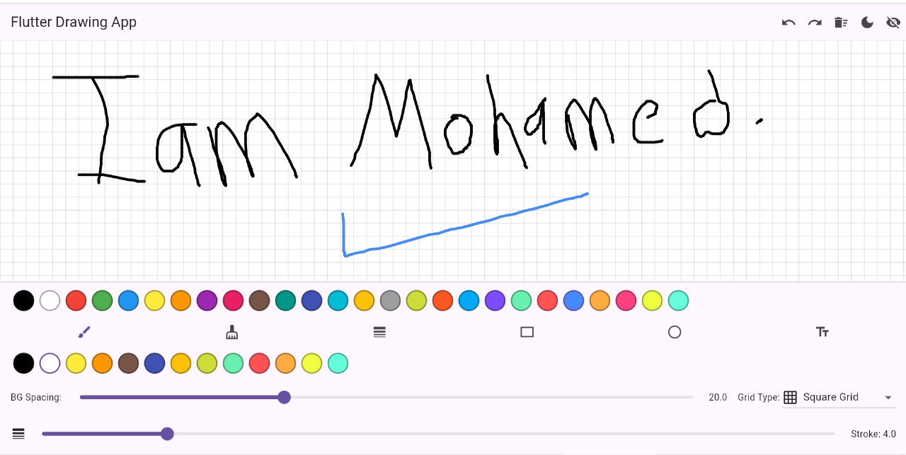
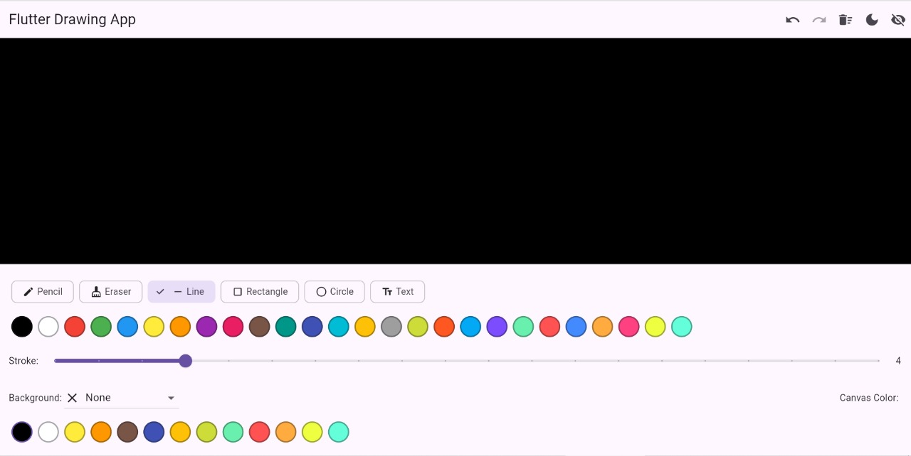
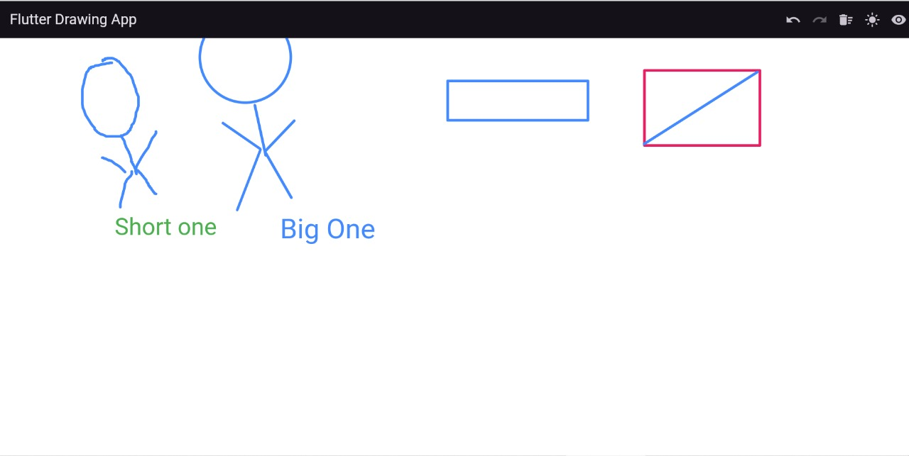

# 🎨 Flutter Drawing App

A powerful and customizable drawing application built with Flutter.  
Designed for flexibility and creativity, the app offers a range of tools for freehand drawing, background customization, text insertion, and more.

---

## ✨ Features

- 🖌️ **Freehand Drawing** with customizable stroke color and width.  
- 🧱 **Draw Shapes**: Rectangle, Circle, and Straight Line tools.  
- 🆎 **Add Text** with custom color and size.  
- 🎨 **Background Options**:
  - Solid Color
  - Dotted Grid
  - Square Grid
  - Ruled Lines  
- 🔄 **Undo / Redo** system for recent actions.  
- 🧹 **Clear Canvas** instantly with one tap.  
- 🌗 **Light and Dark Themes** support.  
- 🎚️ **Adjust Background Thickness** (lines, dots, etc.).


## 🗃 App_Images
---






---

## 🚀 Getting Started

To run the app locally:

```bash
git clone https://github.com/your-username/flutter-drawing-app.git
cd flutter-drawing-app
flutter pub get
flutter run
